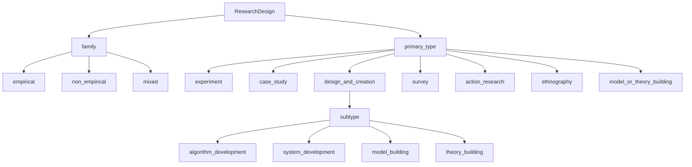
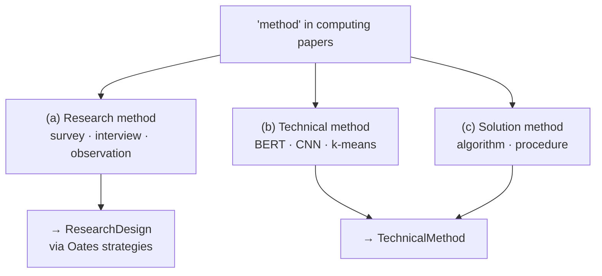
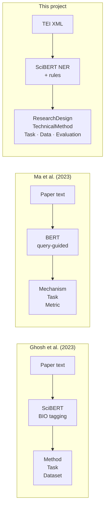
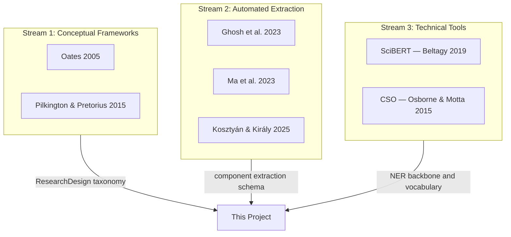

You should submit a draft literature survey for your project. This should be a document covering at least 4-6 examples of previous work or academic literature. 

Examples of types of literature you might want to include:

Examples of projects that are similar to your own (these can be the same as those used in your proposal).

Techniques and methods that you plan to use. These could be software libraries, algorithms, or research methodologies. 

Research studies that show the effectiveness of the project you intend to create (for example, if you are doing a project on educational technology, a psychological or educational study showing that the techniques you are using are effective for teaching). 

This literature can include academic papers and books. It can also include online articles and websites, but in that case,  you should also explain why you consider them credible sources. 

You should evaluate the literature and explain how it contributes to your project, or how it demonstrates the gaps that your project intends to fill. 

The report should be in PDF format, up to 6 pages (minimum font size 11pt, minimum margin 2cm). There is a word limit in the summative assessments of 2500 words for your literature review, so it is a good idea to try to keep within this limit. You may include additional pages of images and citations. 

You should, if appropriate, use visual materials, for example, images and diagrams from the literature you are citing. If you do include such items, you also must cite them appropriately. You might also want to include tables that compare different examples of prior work. 

Note that a good literature review is more than just a serial summary of the items you’ve chosen to present. Drawing similarities, identifying differing views, contrasting, etc., is the added value that a high quality review provides to the reader. This aspect is what makes a review pertinent to your particular topic and the focus you are taking for it.

All work discussed should be properly cited and referenced.

Grading Criteria Overview
You will be marked according to the following criteria:

Does the report display knowledge of the area of study, previous work and academic literature?

Does the report critically evaluate the previous work and/or academic literature?

Does the report use proper citation and referencing?

Does the report add value beyond summarising the different work coherently?

----

## 1. Introduction

This literature survey examines work in three areas relevant to this project:
(1) frameworks that define research methodology in computing,
(2) computational methods for extracting methodology information from paper text,
and (3) enabling technologies — scientific language models and knowledge organisation systems.

The central research question is: can a structured methodology profile — covering research design, technical method, task, data, and evaluation — be automatically extracted from a computing research paper? The selected literature addresses parts of this question, but not the full profile proposed in this project. This survey shows why, and positions this project in relation to existing work.

In this project, "methodology" is used in a broader computational sense than in Oates or Pilkington and Pretorius. It refers to a structured profile containing both the research strategy of a paper (ResearchDesign) and the technical components used in the work (TechnicalMethod, Task, Data, Evaluation). This broader scope is necessary because the project aims to extract an observable profile from paper text, rather than reconstruct the author's full methodological reasoning.

Papers were selected by relevance to the project schema and pipeline. Where a paper has known limitations for this project, these are stated explicitly.

---

## 2. Conceptual Foundations: Defining Research Methodology

### 2.1 Oates (2005)

Oates (2005) provides the primary theoretical framework for this project's ResearchDesign component. The book defines six research strategies used in information systems and computing research: survey, experiment, case study, action research, ethnography, and design and creation. Each strategy has a distinct epistemological basis and produces different types of evidence. For example, an experiment tests a causal hypothesis under controlled conditions, while a case study produces rich contextual understanding of a specific phenomenon.

For computing and AI papers, the design and creation strategy is central. Oates defines it as research that produces a new IT artefact — which may be a model, algorithm, system architecture, framework, or prototype — and also evaluates it. This matches a large proportion of modern machine learning papers, which propose a new architecture or method and evaluate it on benchmarks.

This project adapts Oates' strategies as primary_type labels in the ResearchDesign schema (experiment, case_study, design_and_creation, survey, action_research, ethnography). The hierarchical design (family → primary_type → subtype) is not present in Oates but is added in this project to represent mixed-strategy papers, which are common in computing research.

One limitation of Oates (2005) for this project is temporal: the book predates the deep learning era. Modern AI papers often combine design and creation (proposing a model) with experiment (benchmarking it) in a single paper. Oates does not provide guidance on how to handle such combinations. This is an annotation challenge. Oates also focuses on the IS discipline, and some strategies (e.g. action research, ethnography) appear rarely in AI/NLP papers. For AI and NLP papers in particular, Oates' categories may be too coarse when used as mutually exclusive single labels: most such papers combine design and creation with an experimental evaluation. This project therefore treats ResearchDesign as a multi-label hierarchical field (primary_type + secondary_types) rather than a single exclusive class.

*Figure 1: ResearchDesign hierarchy used in this project. Primary_type labels are from Oates (2005). The subtype field (under design_and_creation) is an addition not present in Oates.*

### 2.2 Pilkington and Pretorius (2015)

Pilkington and Pretorius (2015) develop a conceptual ontology of the research methodology domain specifically for computing fields. Their model has three levels: philosophical worldview (positivism, interpretivism, pragmatism), research design (empirical: experiment, case study, survey; or non-empirical: theoretical), and research methods (qualitative, quantitative, or theoretical methods such as argumentation).

The key contribution for this project is the explicit distinction between research design and research method. In computing papers, the word "method" is ambiguous. Authors use it to mean: (a) a research method such as questionnaires or observation, (b) a technical method such as a neural network model, or (c) a solution method such as an algorithm. Pilkington and Pretorius separate level (a) from the others, and their distinction justifies the decision in this project to use the label TechnicalMethod for neural network models and algorithms — keeping it separate from ResearchDesign, which refers to the overall research strategy.

*Figure 2: Three uses of 'method' in computing papers. Pilkington and Pretorius (2015) separate sense (a) from the others. This project uses distinct schema fields for each sense.*

Their model was validated by a focus group of ten senior computing researchers, adding empirical credibility. However, it was designed for ontology engineering and student support tools, not for automatic extraction from text. It provides no operationalisation guidance — no rules for identifying research design from abstract text, no indicative vocabulary lists. This gap is partly addressed in this project through regex-based design detection, but the rules are heuristic and require further validation.

**Comparison.** Oates and Pilkington and Pretorius address complementary aspects. Oates is more operational and applied, providing a named list of strategies that can be used directly as labels. Pilkington and Pretorius provide a formal ontological structure that separates research design from research methods. Together they justify the distinction between ResearchDesign and TechnicalMethod in this project's schema, which is not made explicit in any prior extraction work reviewed below.

---

## 3. Computational Approaches to Methodology Extraction

*Figure 3: Extraction pipeline comparison. All three convert paper text to structured methodology components, but differ in input format, model type, and output schema.*

### 3.1 Sequence Labeling: Ghosh et al. (2023)

Ghosh et al. (2023a; 2023b) present the work most directly related to this project. They address the task of extracting methodology component names from AI research papers. A conference paper at CIKM 2023 (Ghosh et al., 2023b) and an extended arXiv version (Ghosh et al., 2023a) share the same core contribution and are treated here as one research group.

The technical approach is sequence labeling with BIO tagging using SciBERT as the backbone encoder. The model extracts three component types: Method (corresponding to TechnicalMethod in this project), Task, and Dataset (corresponding to Data). Training data is drawn from PapersWithCode, a community-maintained database of 34,560 AI papers annotated with structured metadata. This constitutes a large-scale silver-standard dataset — the labels are generated from community contributions, not expert annotators, which introduces noise.

A central challenge they identify is the size and growth rate of the methodology vocabulary. Method names in AI are numerous, domain-specific, and evolve rapidly. A model trained on papers from 2017 or earlier will not have seen architectures such as GPT-3 or Vision Transformers, which appeared later. To address this, they propose factored sequence labeling: the label space is split into domain-based subsets (seven categories: General, CV, Seq2Seq, RL, NLP, Audio/Speech, Graph). They compare two factoring strategies: ontology-driven (using PapersWithCode's domain categories) and data-driven (k-means clustering on SciBERT embeddings). Data-driven factoring with k=2 achieves the best performance, with an F-score of approximately 0.40 on emerging methodology names — terms that appear in the test set but not in training data.

Evaluation uses a chronological train-test split: papers published up to 2017 form the training set, papers after 2017 form the test set. This is more realistic than random splitting because it simulates deployment where a model must identify newly emerging methods.

**Limitation for this project.** Ghosh et al. do not extract ResearchDesign. A paper using BERT for sentiment analysis in an experiment and a paper describing a deployed BERT-based system as a case study would produce identical output in their framework, but different output in this project. Their work is also restricted to AI domain papers; generalisation to IS or software engineering papers is not validated. Silver-standard labels from PapersWithCode may underrepresent rare methodology types.

This project inherits the sequence labeling intuition from Ghosh et al. and uses SciBERT for candidate extraction. The key added dimension is ResearchDesign, which is outside the scope of Ghosh et al.'s work.

### 3.2 Query-guided Extraction: Ma et al. (2023)

Ma et al. (2023) approach methodology extraction differently. They define a "metric-driven mechanism" schema with three components: Mechanism (approximately TechnicalMethod), Metric (approximately Evaluation), and Task. They use a BERT-based model combined with a query-guided sequence-to-sequence extractor: the model is given a question such as "what is the mechanism used?" and extracts the answer from the paper text.

Their dataset consists of manually annotated NLP papers, which provides higher annotation quality than the silver-standard labels used by Ghosh et al., but covers a narrower domain (NLP only) and is smaller in scale. The query-guided approach is more flexible for open-ended extraction but requires the question to be specified in advance.

**Comparison with Ghosh et al.** Both papers share the goal of structured extraction, but differ in approach. Ghosh et al. use sequence labeling (NER-style, boundary detection), while Ma et al. use query-guided generation (answer extraction). Sequence labeling is more suitable for named entities with clear boundaries; query-guided extraction is more flexible for longer spans. Both papers extract TechnicalMethod and Task but neither extracts ResearchDesign. Ma et al. add Evaluation (Metric) while Ghosh et al. add Data (Dataset). The complementary coverage of these two works suggests that a complete schema requires elements from both.

**Gap.** Both papers treat methodology extraction as a technical NLP task without grounding the schema in a methodological theory such as Oates (2005) or Pilkington and Pretorius (2015). The label ResearchDesign does not appear in either paper. Ma et al. are also limited to NLP papers, which restricts generalisability.

### 3.3 Document-level Classification: Kosztyán and Király (2025)

Kosztyán and Király (2025) address a different aspect of methodology identification: classifying whether a paper uses a quantitative or qualitative research methodology. They use XGBoost with features derived from full paper text — not just abstracts. The classifier achieves accuracy above 90% across three domains: tourism (229 papers), medical science (557 papers), and information systems as an application example. A key finding is that using the full paper body significantly improves classification accuracy over using only abstracts or titles.

The paper argues that classic ML methods (XGBoost) are preferable to transformer-based models for this task because methodology classification does not require full contextual understanding of the paper, only identification of relevant vocabulary across sections. This contrasts with Ghosh et al., who use SciBERT because context is necessary for boundary detection of technical term names.

**Limitation for this project.** The binary quantitative/qualitative distinction is too coarse for the goals of this project. A quantitative study could be an experiment, a survey, or a design-and-creation paper with benchmarking — these have different research designs that matter for paper comparison. The coarse binary label loses this information. However, this paper provides useful evidence that some methodology-related signals can be detected from full paper text using non-generative models — consistent with the general feasibility of automated methodology classification, though not specific to this project's regex-based approach.

---

## 4. Enabling Technologies

### 4.1 Scientific Language Models: SciBERT

Beltagy, Lo and Cohan (2019) introduce SciBERT, a BERT model pretrained on approximately 1.14 million papers from Semantic Scholar, covering computer science (18%) and biomedical science (82%). The vocabulary and model weights are specialised for scientific text, where common terms such as "attention", "encoder", "backbone", and "loss" carry domain-specific meanings different from general English.

SciBERT achieves consistent improvements over BERT-Base across five scientific NLP tasks: named entity recognition, PICO extraction, relation classification, sentence classification, and parsing. On biomedical NER tasks, it outperforms BERT-Base by 3–4 F1 points.

This project uses SciBERT for Step 1 of the pipeline — candidate extraction via NER — motivated by two factors. First, the vocabulary of computing methodology terms (BERT, Transformer, ResNet, Adam, BLEU, F1) is domain-specific and benefits from a scientifically pretrained tokenizer. Second, Ghosh et al. (2023a) use SciBERT as their backbone and demonstrate its suitability for methodology extraction.

**Limitation.** The specific NER checkpoint used in this project is a general scientific NER model, not specifically trained for methodology extraction. The exact recall and precision on methodology terms are not known before running error analysis. Furthermore, SciBERT's token limit of 512 tokens means full paper text cannot be processed as a single input; this project processes sentence by sentence with max_length = 128, which prevents the model from using cross-sentence context for entity detection. This is an acknowledged limitation of the prototype.

A more fundamental limitation is that NER-style extraction suits TechnicalMethod, Task, Data, and Evaluation — named entities with identifiable text spans — but not ResearchDesign, which is a document-level inference. Identifying that a paper is an experiment rather than a case study requires understanding the overall structure and purpose of the paper, not spotting a named entity. This project addresses this through a separate regex-based design detection step applied to the abstract and section headings.

### 4.2 Knowledge Organisation: CSO and Klink-2

Osborne and Motta (2015) describe the Klink-2 algorithm and the Computer Science Ontology (CSO), a large-scale knowledge organisation system of approximately 14,000 computer science topics (Salatino et al., 2020). CSO is relevant because some TechnicalMethod and Task labels in this project overlap with CSO topics, such as BERT, ResNet, machine translation, and object detection. However, CSO organises research topics rather than research methodology — it cannot distinguish ResearchDesign from TechnicalMethod — so it can only serve as a background reference for vocabulary coverage, not as the project's label schema.

### 4.3 PDF Structure Extraction: GROBID

GROBID (GeneRation Of BIbliographic Data) is a machine learning library for parsing scholarly PDFs into structured TEI XML (Lopez, 2009). It identifies document structure — title, abstract, section headings, body paragraphs, and references — and separates them cleanly. This project uses GROBID version 0.8.1 via Docker as the preprocessing step that converts PDF papers into TEI XML before the extraction pipeline runs.

GROBID is relevant to extraction quality because parsing errors propagate downstream. A misidentified section boundary or failed heading detection produces candidates with wrong section labels, which can mislead both role classification and ResearchDesign detection. Using TEI XML also provides reference separation for free: GROBID places bibliography entries in a `<listBibl>` element outside the body, preventing reference list terms from appearing as false positive methodology candidates.

---

## 5. Synthesis and Positioning

### 5.1 Three separate streams

For the purposes of this project, the reviewed literature can be organised into three streams that are rarely connected explicitly:

**Stream 1 — Conceptual frameworks** (Oates, 2005; Pilkington and Pretorius, 2015): define what research methodology is in computing. They are theoretical and provide no computational operationalisation.

**Stream 2 — Automated extraction** (Ghosh et al., 2023a, 2023b; Ma et al., 2023; Kosztyán and Király, 2025): extract or classify methodology from paper text. They do not ground their labels in the theoretical frameworks from Stream 1. Ghosh et al. and Ma et al. extract TechnicalMethod and Task but not ResearchDesign. Kosztyán and Király classify ResearchDesign but only at a coarse binary level, and do not extract TechnicalMethod or Task.

**Stream 3 — Technical tools** (Beltagy et al., 2019; Osborne and Motta, 2015): provide infrastructure for scientific text processing and knowledge organisation, but are not designed specifically for methodology extraction.

*Figure 4: The three literature streams and their contribution to this project. Among the reviewed works, none connects all three.*

### 5.2 The core gap

Among the works reviewed here, none builds a complete structured methodology profile that includes both ResearchDesign (at the strategy level of Oates) and TechnicalMethod/Task/Data/Evaluation (at the component level of Ghosh et al. and Ma et al.) for a single paper. This is the gap this project attempts to fill.

The specific contribution is to ground the TechnicalMethod/Task schema (from Ghosh and Ma) in the ResearchDesign taxonomy from Oates and Pilkington and Pretorius. The result is a five-part schema — ResearchDesign, TechnicalMethod, Task, Data, Evaluation — that captures both the research strategy and the technical components of a paper.

A comparison of the three extraction papers is shown in Table 1.

| | ResearchDesign | TechnicalMethod | Task | Data | Evaluation |
|-|:-:|:-:|:-:|:-:|:-:|
| Ghosh et al. (2023) | — | ✓ | ✓ | ✓ | — |
| Ma et al. (2023) | — | ✓ | ✓ | — | ✓ |
| Kosztyán & Király (2025) | binary only | — | — | — | — |
| **This project** | **✓ (Oates)** | **✓** | **✓** | **✓** | **✓** |

*Table 1: Comparison of methodology extraction schemas.*

In this schema, ResearchDesign and Evaluation are distinct levels of description. ResearchDesign captures the paper-level strategy — for example, whether the paper uses experimental evaluation — while Evaluation captures the concrete metrics, benchmarks, and criteria applied within that strategy.

### 5.3 Design choices and their justification

This project uses a rule-based approach for role classification and ResearchDesign detection. The rule-based component is not presented as a final extractor but as an interpretable baseline for testing whether the proposed schema is operationalisable from paper text. At the prototype stage, interpretable rules allow direct error analysis: a missed entity can be traced to a missing regex pattern or keyword, whereas a neural model's error is harder to diagnose without a gold-standard dataset.

Kosztyán and Király (2025) suggest that some methodology signals are recoverable using non-generative models, though their binary label set is not directly equivalent to this project's five-part schema. Their result supports the feasibility of automatic methodology classification in general, not the accuracy of regex extraction in particular.

### 5.4 Open problems

**Evaluation framework.** Ghosh et al. evaluate extraction using standard NER metrics (precision, recall, F1) on individual entity types. For a complete methodology profile with five components, this project requires evaluation at two levels. First, component-level evaluation: precision, recall, and F1 for TechnicalMethod, Task, Data, and Evaluation, measured against a manually annotated gold-standard set. Second, profile-level evaluation: human judgement of whether the extracted ResearchDesign field correctly identifies the paper's research strategy. How to weight these two levels and how to handle partial overlap in TechnicalMethod lists are open questions to be resolved in the evaluation phase.

**Silver vs. gold standard.** Ghosh et al. use PapersWithCode labels (silver standard). This project has no annotated dataset at this stage. Evaluation will depend on manual annotation of a small gold-standard set (10–20 papers planned). Inter-annotator agreement has not yet been tested. Because the gold-standard set is small, the evaluation will be exploratory rather than statistically conclusive.

**Cross-domain generalisation.** All extraction work reviewed was developed on a specific domain. This project was tested only on "Attention Is All You Need" (a deep learning paper). Whether the pipeline generalises to IS, software engineering, or HCI papers is unknown.

---

## References

Beltagy, I., Lo, K. and Cohan, A. (2019) 'SciBERT: A pretrained language model for scientific text', in Inui, K., Jiang, J., Ng, V. and Wan, X. (eds.) *Proceedings of the 2019 Conference on Empirical Methods in Natural Language Processing and the 9th International Joint Conference on Natural Language Processing*. Hong Kong: Association for Computational Linguistics, pp. 3615–3620. doi: 10.18653/v1/D19-1371.

Ghosh, M., Ganguly, D., Basuchowdhuri, P. and Naskar, S.K. (2023a) *Enhancing AI research paper analysis: methodology component extraction using factored transformer-based sequence modeling*. arXiv:2311.03401. Available at: https://arxiv.org/abs/2311.03401.

Ghosh, M., Ganguly, D. and Naskar, S.K. (2023b) 'Extracting methodology components from AI research papers: a data-driven factored sequence labeling approach', in *Proceedings of the 32nd ACM International Conference on Information and Knowledge Management (CIKM 2023)*. doi: 10.1145/3583780.3615258.

Kosztyán, Z.T. and Király, T. (2025) 'Automated research methodology classification using machine learning', *Engineering Applications of Artificial Intelligence*, article 111039. doi: 10.1016/j.engappai.2025.111039.

Lopez, P. (2009) 'GROBID: Combining automatic bibliographic data recognition and term extraction for scholarship publications', in *Research and Advanced Technology for Digital Libraries: 13th European Conference, ECDL 2009*, Lecture Notes in Computer Science, 5714. Corfu, Greece: Springer, pp. 473–474.

Ma, Y., Liu, J., Lu, W. and Cheng, Q. (2023) 'From "what" to "how": Extracting the procedural scientific information toward the metric-optimization in AI', *Information Processing & Management*, 60(3), article 103315. doi: 10.1016/j.ipm.2023.103315.

Oates, B.J. (2005) *Researching information systems and computing*. London: SAGE Publications.

Osborne, F. and Motta, E. (2015) 'Klink-2: integrating multiple web sources to generate semantic topic networks', in Gandon, F., Sabou, M., Sack, H., d'Amato, C., Cudré-Mauroux, P. and Zimmermann, A. (eds.) *The Semantic Web – ISWC 2015*. Cham: Springer International Publishing, pp. 408–424. doi: 10.1007/978-3-319-25007-6_24.

Pilkington, C. and Pretorius, L. (2015) 'A conceptual model of the research methodology domain', in *Proceedings of the International Joint Conference on Knowledge Discovery, Knowledge Engineering and Knowledge Management (IC3K 2015)*. Setúbal: SCITEPRESS – Science and Technology Publications, pp. 96–107. doi: 10.5220/0005613100960107.

Salatino, A.A., Thanapalasingam, T., Mannocci, A., Osborne, F. and Motta, E. (2020) 'The computer science ontology: a comprehensive automatically-generated taxonomy of research areas', *Data Intelligence*, 2(3), pp. 1–20. doi: 10.1162/dint_a_00055.
